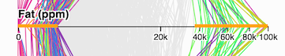
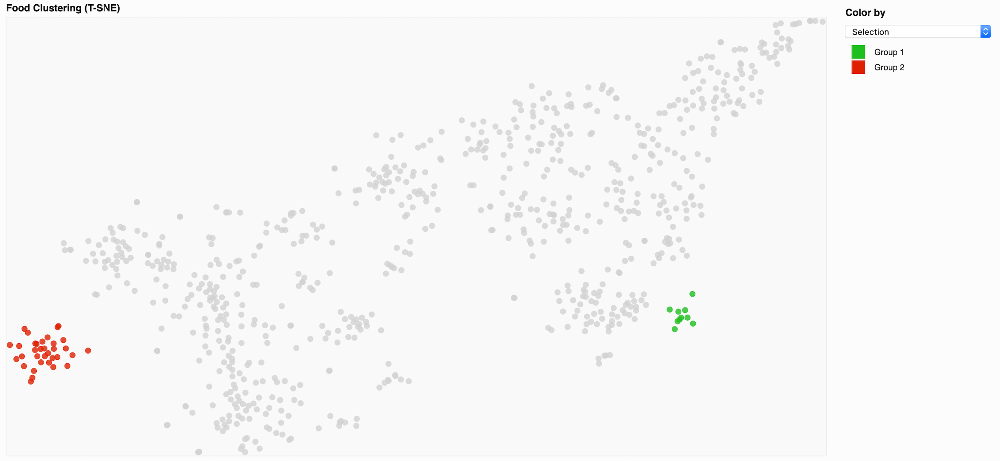

# FooDB Visualizer

**Suhayb Abunijem** 914956143

**Kiel Chapin-Riddle** 914325428

**Gabriel Simmons** 912090946

### Motivation

​		Science and medicine are experiencing a trend towards "personalized medicine" - therapies and health interventions tailored specifically to unique individuals. As personalized medicine becomes more popular, detailed knowledge of food constituents will be increasingly important. As an example, this type of knowledge will enable doctors to advise patients to avoid foods containing chemicals that may interact with their prescribed medications. It may also enable dietary recommendations to be made at the individual level, based on the prediction of how chemical food constituents will interact with each person's genome. 

​	FooDB is a dataset documenting the chemical constituents of thousands of whole foods and recipes. Our intention was to design an interface to the database that communicates the chemical composition of foods or groups of foods, as well as similarity between foods and trends among food constituents. Our intended audience is someone familiar with nutrition basics, who is looking for more detailed information about chemical food constituents. 

### Dataset and Preprocessing

​	The FooDB database is stored in several tables. The `contents` table includes one row for each known pair of a compound or nutrient and it's containing food, with columns describing information about the compound or nutrient as well as the source of the information. Other tables include more detailed information about foods, nutrients, and compounds. 

​	For our visualization we required a table with rows corresponding to individual foods, and columns corresponding to food properties. We used Python and the `pandas` library to construct this data table. This involved reformatting the `contents` table as a crosstable with rows corresponding to foods, and columns corresponding to constituents (compounds or nutrients), and then joining additional relevant information from other tables in the database. See `report/preprocessing.pdf` for more details. The resulting data table used in our visualization (`data/foods_final.csv`) contains ~760 foods and ~330 food properties. 

​	For our scatter plot visualization, we used t-SNE to represent these 300+ food properties in 2 dimensions. The t-SNE embedding was also done in Python and the results were appended as two additional columns in `foods_final.csv`.

### Summary of initial proposal

​	Our initial proposal was a scatter plot of points representing individual foods, with mutual interactions with a parallel coordinates plot of nutritional information and both would have outbound iteractions to a sunburst displaying chemical compositions.  Lassoing items in the scatter plot or brushing the axes of the parallel coordinates plot would filter the data, and that resulting filter would be used to construct the sunburst.  Tooltips were planned for datapoints in the scatter plot and chemicals in the sunburst.  The parallel coordinates plot would be stored in a collapsible sidebar when not needed, to conserve page space.  We planned marks and channels remapping but did not specify how.  
​	We designed this with the belief that centralizing the visualization system around foods and similarities therein would provide the most intuitive model for users.  Alternative models such as starting from chemicals and enableing users to find foods with certain concentrations of those chemicals would have been possible, but we felt this would run counter to how most people think about food.  

### Description of final visualization

##### Scatter Plot

​	Our final version has a scatter plot of points representing individual foods, with mutual interactions with a parallel coordinates plot of nutritional information Lassoing items in the scatter plot or brushing the axes of the parallel coordinates plot filters the data, and that resulting filter is used to construct the icicle plot.  Tooltips are implemented for datapoints in the scatter plot.  Clicking a data point in the scatter plot pulls up an informational pane with the common name, scientific name, and link to a wikipedia article for the corresponding food. Clicking a color in the color legend permits changing that color for both the scatter plot and parallel coordinates plot. The user is able to compare groups of data points on the scatter-plot by using color by selection, then use the lasso tool while holding the shift key to make multiple selections.

##### Parallel Coordinates
The parallel coordinates visualization displays the carbohydrates, fats, proteins and fiber of each food item. The user can brush on an axis to filter out a range. The user can also add multiple ranges on a single axis by holding the shift key while brushing.

All filtration interactions are connected across all three visualizations and are used by the icicle plot which displays chemical compositions.   

##### Icicle Plot

​	We implemented an icicle plot that shows the aggregate chemical composition of the user's selection. Chemicals in the database are grouped hierarchically, by superklass, klass, and subklass. The Icicle plot displays this hierarchical information, with horizontal size corresponding to the percentage of the total compounds in the selection constituted by each category. Since some compounds make up generally small percentages of most foods in the database, their corresponding cells in the icicle plot are small. To allow the user to inspect these cells, we added zooming functionality to the icicle plot. Once zoomed in, the user can also pan left and right by clicking slivers of the adjacent cells. This allows the user to explore a lower level of the hierarchy without having to zoom up and then down again.

##### Design changes & design justification

​	We found that a sunburst was unlikely to have enough room to place text for any chemical that composed a very small portion of the food(s) selected.  We thus switched it for an icicle plot, which would have more room to insert text by virtue of being able to be placed along the bottom of the screen to use the entire horizontal span of its designated area.  

​	We had originally planned to implement a navigable 3D point cloud (using 3D t-SNE embeddings instead of 2D), and this was intended to be the centerpiece of our visualization. To keep focus on this point cloud, we planned to have the accompanying visualizations appear from a sidebar or as popup windows. We switched to a 2D scatterplot for simplicity, and since we felt that this more basic scatter plot did not require so much of the user's attention, we did not give it such a central position in our layout. As a result, the parallel coordinates plot and icicle plot were given permanent positions outside of the sidebar. 

##### Potential improvements and known bugs

- The icicle plot and the rest of the visualizations share the same color scheme, even though the color meanings are not shared. 
- Difficult to find two unique color schemes that can encode the required number of categories without clashing aesthetically.  Might be better to shift to shades of gray for the icicle plot?  
- Icicle plot has a number of vertical segments that are difficult/impossible to see due to their small size.  Implementing different scaling or zooming might solve this.  
- Having the instructions pane start open would aid in finding it.  
- The icon for the instructions pane does not revert to the 'expand' icon if it is displaying the 'x' when the page is refreshed normally.  
- We would like to add an option to select a cell of the icicle plot, and change all points in the user's lasso selection to the cell's color, with saturation corresponding to richness of the compound represented by the cell. This would allow the user to select a compound, and see which foods are rich in this compound. 

### Task Division
##### Suhayb
* Parallel Coordinates Visualization.
* Color management system (color on key).
* Implemented a multi-filter system and integrated the system across the scatter plot & Parallel Coordinates (Add filters by holding the shift key).
* Color on lasso selection. (Compare two selections by: setting color by "Selection" then making two selections while holding the shift-key).
* Stylized the tooltip & descriptions box.
* Contributed to the report

##### Kiel
* Kiel did a version of the scatter plot and a sunburst plot that were not put into the final version.
* He implemented the color remapping palette. 
* Implemented the tooltip & descriptions that show when the user clicks on a point in th scatter plot.
* He also made minor asthetics improvements and contributed heavily to this report.  

##### Gabriel
* Implemented basic version of the scatter plot with lasso selection that was included in the final version
* Implemented icicle plot
* Data preprocessing & dimensionality reduction
* Contributed to the report
